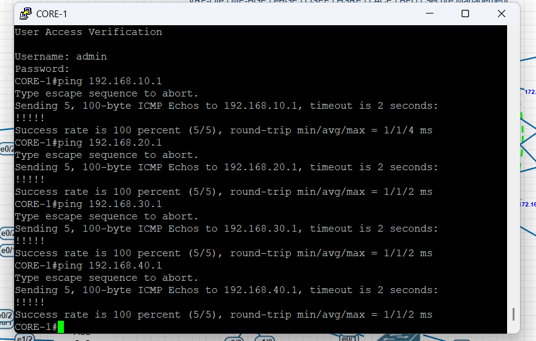
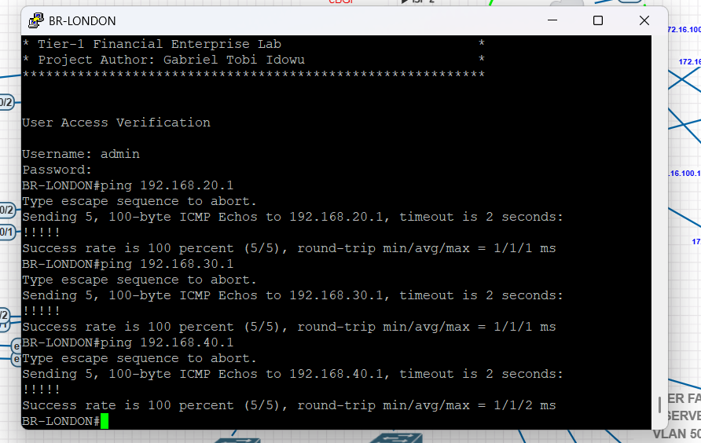
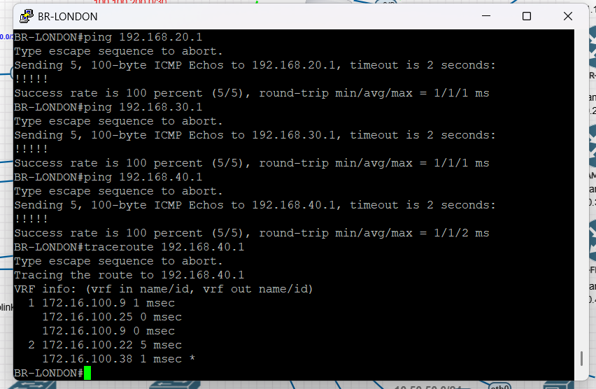

# Enterprise Multi-Site Network Infrastructure

# Network Validation Report

---

**Project Name:** Enterprise Multi-Site Network Infrastructure

**Project Author:** Gabriel Tobi Idowu

**Version:** 1.0

**Date:** July 2026

---

# Table of Contents

1. Overview
2. Validation Objectives
3. OSPF Validation
4. BGP Validation
5. DMVPN Phase 3 Validation
6. HSRP Validation
7. EtherChannel Validation
8. VRF-Lite Validation
9. BFD Validation
10. End-to-End Connectivity
11. Summary

---

# 1. Overview

This document records the validation and verification activities performed after implementing the Enterprise Multi-Site Network Infrastructure.

The objective is to demonstrate that all configured technologies operate correctly and that end-to-end connectivity has been successfully established across the enterprise network.

Testing was performed within the EVE-NG simulation environment using Cisco IOS CLI verification commands.

---

# 2. Validation Objectives

The validation process was designed to verify the following:

- OSPF neighbor relationships
- OSPF route propagation
- eBGP and iBGP neighbor establishment
- MP-BGP route advertisement
- DMVPN Phase 3 tunnel establishment
- NHRP registration
- HSRP redundancy
- EtherChannel operation
- VRF-Lite functionality
- BFD neighbor status
- End-to-end IP connectivity
- Successful routing convergence

- ---

# 3. OSPF Validation

## Objective

To verify that all OSPF neighbor relationships were successfully established and that routes were correctly exchanged between participating routers.

## Verification Commands

```bash
show ip ospf neighbor
show ip route ospf
show ip protocols
```

## Validation Results

The OSPF topology formed successfully across all participating routers.

Verification confirmed:

- OSPF neighbor adjacencies reached the FULL state.
- Routes were successfully learned through OSPF.
- Backbone and non-backbone areas exchanged routes correctly.
- Dynamic routing convergence completed successfully.

## Evidence

> <p align="center">
  
</p> OSPF Neighbor Table (`show ip ospf neighbor`)

> <p align="center">
  
</p> OSPF Routing Table (`show ip route ospf`)

## Result

✅ PASS

OSPF operated as designed and successfully exchanged routing information throughout the enterprise network.

---

# 4. BGP Validation

## Objective

To verify successful operation of External BGP (eBGP), Internal BGP (iBGP), and Multiprotocol BGP (MP-BGP) within the WAN infrastructure.

## Verification Commands

```bash
show ip bgp summary
show ip bgp
show ip route bgp
```

## Validation Results

Validation confirmed:

- eBGP neighbor relationships established successfully.
- iBGP sessions established between internal peers.
- MP-BGP exchanged routing information correctly.
- BGP routes were installed into the routing table.

## Evidence

><p align="center">
  
</p>` show ip bgp summary`

><p align="center">
  
</p>  BGP Routing Table

## Result

✅ PASS

BGP routing operated successfully and provided dynamic WAN route exchange.

---

# 5. DMVPN Phase 3 Validation

## Objective

To verify successful establishment of the DMVPN Phase 3 overlay network and proper NHRP operation.

## Verification Commands

```bash
show dmvpn
show ip nhrp
show ip route
```

## Validation Results

Validation confirmed:

- Tunnel interfaces were operational.
- NHRP registrations completed successfully.
- Hub routers recognized all spoke routers.
- Overlay connectivity was successfully established.

## Evidence

> <p align="center">
  
</p> `show dmvpn`

> <p align="center">
  
</p> `show ip nhrp`

## Result

✅ PASS

DMVPN Phase 3 functioned correctly, providing resilient overlay connectivity between headquarters and branch offices.


---

# 6. HSRP Validation

## Objective

To verify that Hot Standby Router Protocol (HSRP) provides default gateway redundancy for the Distribution Layer.

## Verification Commands

```bash
show standby brief
show standby
```

## Validation Results

Validation confirmed:

- Active and Standby roles were correctly assigned.
- Virtual IP addresses were operational.
- HSRP state transitions occurred successfully.
- Gateway redundancy was functioning as designed.

## Evidence

> <p align="center">
  
</p> `show standby brief`

> <p align="center">
  
</p> HSRP Status

## Result

✅ PASS

HSRP successfully provided first-hop redundancy, ensuring continuous gateway availability during failover scenarios.

---

# 7. EtherChannel Validation

## Objective

To verify successful Layer 2 link aggregation using LACP.

## Verification Commands

```bash
show etherchannel summary
show interfaces port-channel
```

## Validation Results

Validation confirmed:

- EtherChannel bundles formed successfully.
- Member interfaces joined the Port-Channel.
- LACP negotiation completed successfully.
- Redundant links operated as a single logical interface.

## Evidence

> <p align="center">
  
</p>` show etherchannel summary`


## Result

✅ PASS

EtherChannel provided increased bandwidth and link redundancy while maintaining stable connectivity.

---

# 8. VRF-Lite Validation

## Objective

To verify logical traffic separation using VRF-Lite.

## Verification Commands

```bash
show vrf
show ip route vrf
```

## Validation Results

Validation confirmed:

- VRF instances were successfully created.
- Interfaces were correctly assigned.
- Independent routing tables were maintained.
- Route separation functioned correctly.

## Evidence

> <p align="center">
  
</p> `show vrf`


## Result

✅ PASS

VRF-Lite successfully provided logical network segmentation while maintaining independent routing tables.

---

# 9. BFD Validation

## Objective

To verify Bidirectional Forwarding Detection (BFD) operation and rapid failure detection.

## Verification Commands

```bash
show bfd neighbors
```

## Validation Results

Validation confirmed:

- BFD neighbor sessions established successfully.
- Fast failure detection operated correctly.
- BFD integrated successfully with BGP.
- Routing convergence improved during link failure events.

## Evidence

<p align="center">
  
</p>

## Result

✅ PASS

BFD successfully enhanced network resiliency by providing rapid detection of forwarding failures.

---

# 10. End-to-End Connectivity Validation

## Objective

To verify successful communication between all enterprise locations and ensure complete end-to-end network connectivity across the WAN infrastructure.

## Verification Commands

```bash
ping <destination-ip>
traceroute <destination-ip>
```

## Validation Results

Connectivity testing confirmed successful communication between Headquarters and all branch offices.

The following tests were successfully completed:

- Headquarters ↔ London
- Headquarters ↔ Dublin
- Headquarters ↔ Amsterdam
- Headquarters ↔ Frankfurt
- London ↔ Dublin
- London ↔ Amsterdam
- London ↔ Frankfurt
- Dublin ↔ Amsterdam
- Dublin ↔ Frankfurt
- Amsterdam ↔ Frankfurt

Traceroute verification confirmed that traffic followed the expected routing paths across the enterprise WAN.

## Evidence

> ### Figure 10.1 – Successful ICMP Connectivity from Headquarters to All Branch Offices



> ### Figure 10.2 – Successful Branch-to-Branch Connectivity Validation



> ### Figure 10.3 – Traceroute Verification Across the Enterprise WAN




## Result

✅ PASS

All enterprise locations achieved successful end-to-end connectivity with no routing failures observed during validation.

---

# 11. Summary

## Validation Summary

Comprehensive testing was performed to verify the functionality, resiliency, and stability of the Enterprise Multi-Site Network Infrastructure.

The validation process confirmed successful implementation of the following technologies:

- Multi-Area OSPF
- eBGP
- iBGP
- MP-BGP
- DMVPN Phase 3
- NHRP
- HSRP
- EtherChannel (LACP)
- VRF-Lite
- BFD
- SSH Secure Management

All routing protocols established the expected neighbor relationships, routes were exchanged successfully, and end-to-end communication was verified across all enterprise locations.

High availability mechanisms, including HSRP, EtherChannel, and BFD, operated as designed, providing redundancy and rapid recovery from simulated failures.

## Conclusion

The Enterprise Multi-Site Network Infrastructure successfully met all project objectives.

The completed implementation demonstrates practical enterprise networking skills, including dynamic routing, WAN design, redundancy, segmentation, and secure device management within an EVE-NG simulation environment.

This project serves as a production-inspired reference implementation and showcases the application of Cisco enterprise technologies in a scalable and resilient network architecture.
