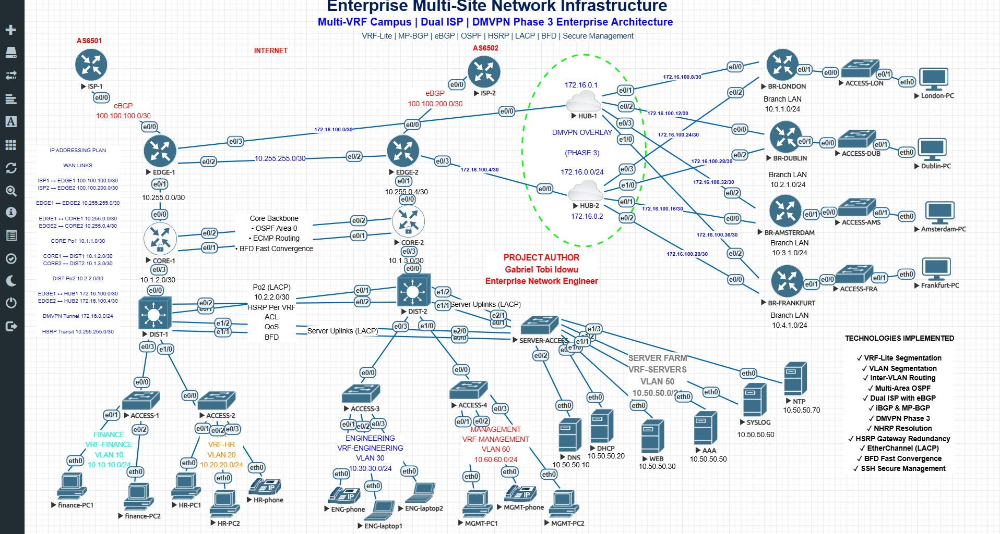

# Enterprise Multi-Site Network Infrastructure

## Project Overview

This project demonstrates the design, implementation, and validation of a resilient multi-site enterprise network built in **EVE-NG** using Cisco enterprise technologies.

The solution follows a hierarchical campus architecture with a redundant Internet edge, dual DMVPN hubs, dynamic routing, gateway redundancy, and departmental segmentation using VRF-Lite.

The environment simulates a headquarters campus connected to four international branch offices through a highly available WAN infrastructure.

---

## Network Topology



### High-Level Architecture

The enterprise network consists of:

- Dual ISP Internet Edge
- Dual Edge Routers (eBGP & iBGP)
- Redundant Core Backbone (OSPF + BFD)
- Redundant Distribution Layer (HSRP + VRF-Lite)
- Layer 2 Access Network
- Dedicated Server Farm
- Dual DMVPN Hub Architecture
- Four International Branch Offices


---

## Architecture Highlights

- Hierarchical Campus Design
- Dual ISP Internet Edge
- Core / Distribution / Access Layers
- Dual DMVPN Hub Architecture
- Four International Branch Offices
- Server Farm
- Departmental Segmentation using VRF-Lite
- High Availability using HSRP and BFD

---

## Technologies Implemented

| Technology | Purpose |
|------------|---------|
| VRF-Lite | Layer 3 Segmentation |
| VLAN Segmentation | Department Isolation |
| Inter-VLAN Routing | Communication Between VLANs |
| Multi-Area OSPF | Internal Routing |
| eBGP | ISP Connectivity |
| iBGP / MP-BGP | Enterprise Route Exchange |
| DMVPN Phase 3 | Branch Connectivity |
| NHRP | Tunnel Resolution |
| HSRP | Default Gateway Redundancy |
| EtherChannel (LACP) | Link Aggregation |
| BFD | Fast Failure Detection |
| SSH | Secure Device Management |

---

## Network Components

### Headquarters

- EDGE-1
- EDGE-2
- CORE-1
- CORE-2
- DIST-1
- DIST-2
- ACCESS Switches
- Server Farm

### WAN

- HUB-1
- HUB-2

### Branch Offices

- London
- Dublin
- Amsterdam
- Frankfurt

---

## High Availability

The enterprise network incorporates multiple redundancy mechanisms:

- Dual ISP Connectivity
- HSRP Gateway Redundancy
- EtherChannel (LACP)
- BFD Fast Convergence
- Redundant Distribution Layer

---

## Validation

The following technologies were successfully validated:

- ✅ OSPF Neighbor Adjacencies
- ✅ BGP Peer Establishment
- ✅ DMVPN Tunnel Registration
- ✅ NHRP Resolution
- ✅ HSRP Active / Standby Operation
- ✅ VRF-Lite Deployment
- ✅ EtherChannel Operation
- ✅ BFD Sessions

---

## Repository Structure

```text
Enterprise-Multi-Site-Network-Infrastructure/

├── Documentation/
├── Configurations/
├── Topology/
├── Screenshots/
└── Videos/
```

---

## Future Enhancements

Future versions of this project may include:

- Cisco SD-WAN
- IPv6
- MPLS L3VPN
- Network Automation with Python & Ansible
- Model-Driven Telemetry

---

## Author

**Gabriel Tobi Idowu**

Enterprise Network Engineering Portfolio
